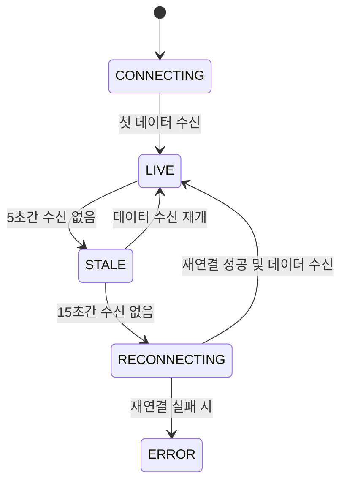

# 데이터 Stale 감지 시스템 디자인 가이드

본 문서는 실시간 데이터 수신 지연 상황을 정의하고, 이를 UI/UX적으로 어떻게 처리할 것인지에 대한 설계를 다룹니다.

## 1. 감지 로직 (Detection Logic)

데이터 흐름은 '연결 상태(Connectivity)'와 '데이터 신선도(Freshness)' 두 가지 축으로 관리됩니다.

### 임계치 설정 (Thresholds)
- **Stale (정체)**: 마지막 이벤트 수신 후 **5초** 경과.
  - 의미: 연결은 유지되고 있으나 데이터가 예상보다 늦게 오고 있음.
- **Lag/Reconnecting (지연/재시도)**: 마지막 이벤트 수신 후 **15초** 경과.
  - 의미: 연결에 문제가 생겼을 가능성이 높음. 시스템은 재연결을 시도하거나 사용자에게 강력한 경고 노출.

## 2. 상태 전이 모델

## 3. UI 시나리오

### [Dashboard Header]
- 상태 배지가 `LIVE`(녹색)에서 `STALE`(회색/황색)로 변경.
- "데이터 수신 지연" 툴팁 또는 문구 노출.

### [Price Chart / Orderbook]
- 데이터 영역에 불투명(Opacity) 처리를 하거나 상단에 "Stale" 배지 노출.
- 마지막 업데이트 시각(예: "10초 전 업데이트됨")을 작게 표시하여 사용자에게 신뢰도 정보 제공.

## 4. 기대 효과
- 사용자가 멈춘 데이터를 실제 시세로 오인하여 잘못된 투자 판단을 내리는 것을 방지.
- 시스템 장애 발생 시 사용자가 이를 즉시 인지하고 대응할 수 있는 투명성 제공.
